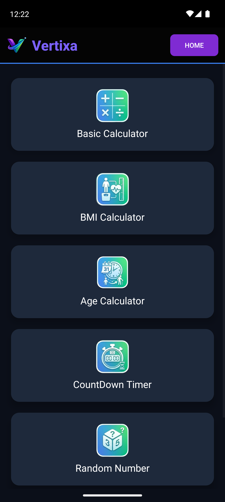
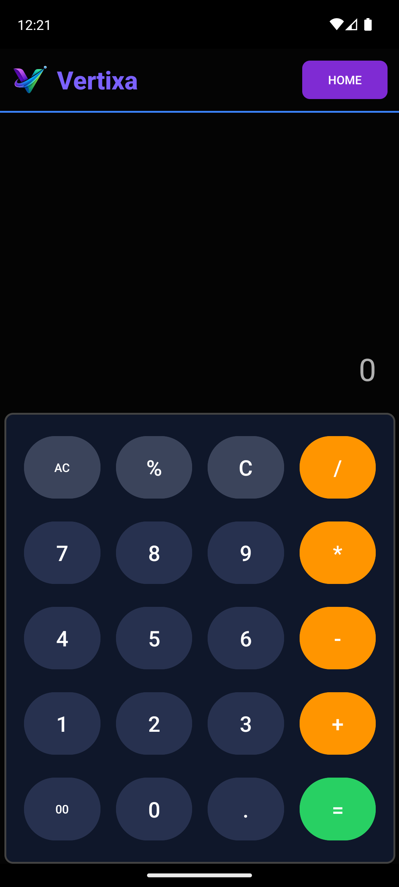
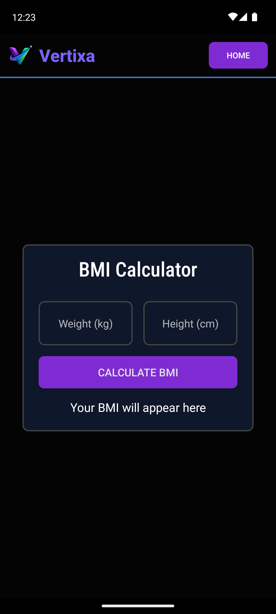
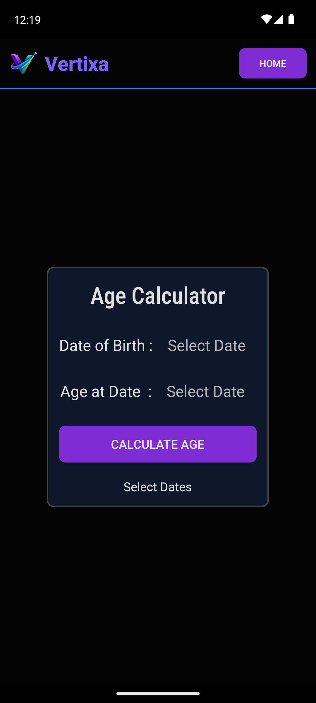
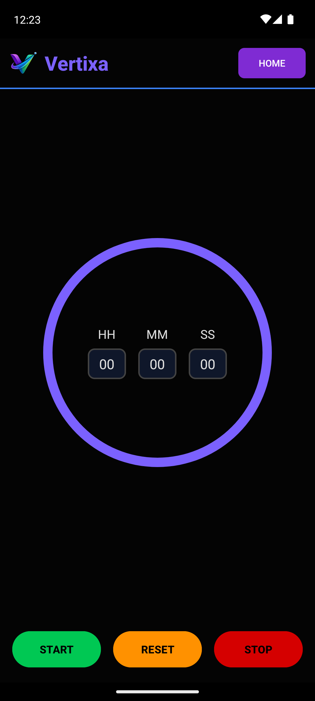
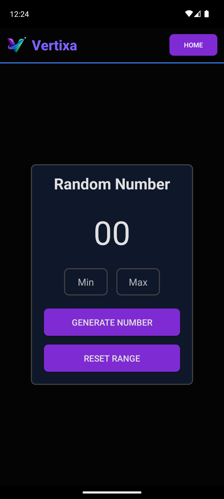
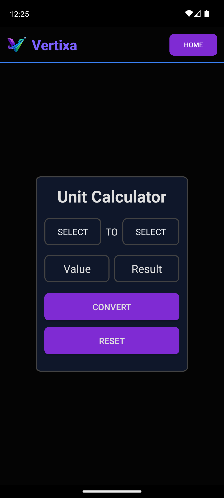

<p align="center">
</p>

# Vertixa - Android App

Vertixa is my **first Android app**!
It is a simple utility app that combines multiple basic tools in a single app for everyday calculations and conversions.

## Features

Vertixa includes the following functionalities:

- **Basic Calculator** – Perform simple arithmetic operations.
- **BMI Calculator** – Calculate Body Mass Index based on height and weight.
- **Age Calculator** – Find your age from your date of birth.
- **Random Number Generator** – Generate random numbers within a range.
- **Countdown Timer** – Set a timer and countdown.
- **Unit Converter** – Convert between different units like length, weight, and more.
- **Customized Splash Screen** – Beautiful splash screen when the app launches.

## Clone this repository

```bash
git clone https://github.com/Rohan-Korake/Vertixa.git
```

---

## Install APK
[Download APK from Google Drive](https://drive.google.com/drive/folders/1lq9vbK_078DHZTuRE_KsqgijHmKOF7cc?usp=drive_link)

## App Preview

Here’s how Vertixa looks across its main features:

<p align="left">
  
  
  
  
  </p>
<p align="left">
  
  
  
  
</p>


## Technologies Used

- Language: Java
- Platform: Android
- IDE: Android Studio
- XML for layouts and UI

## 📞 Contact

For suggestions or contributions, feel free to contact :

- 📧 Email : rohannkorake@gmail.com
- 🔗 Linkedin : https://www.linkedin.com/in/rohan-korake-720848342
